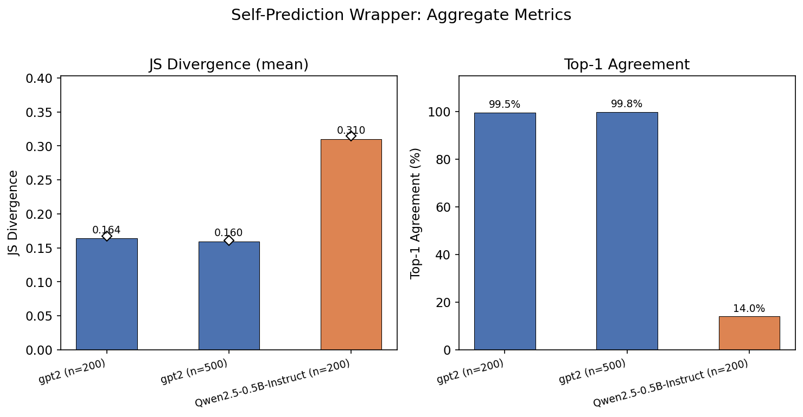
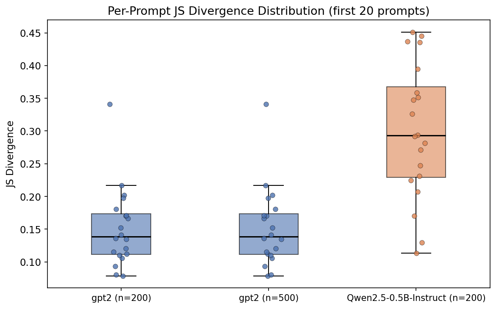
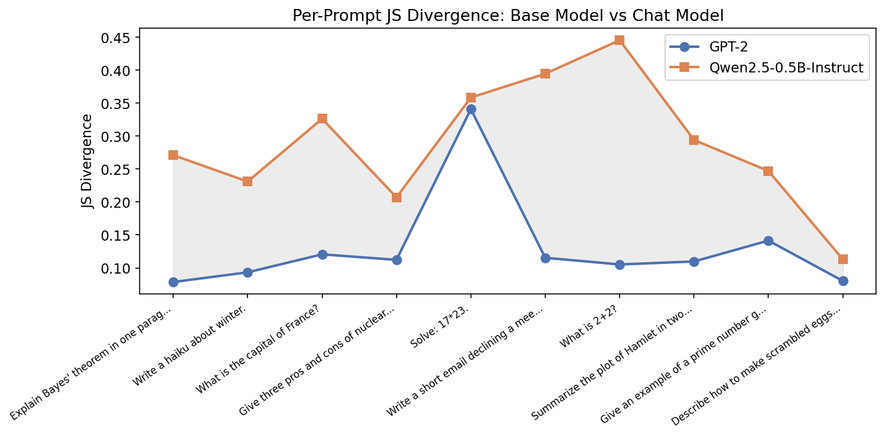
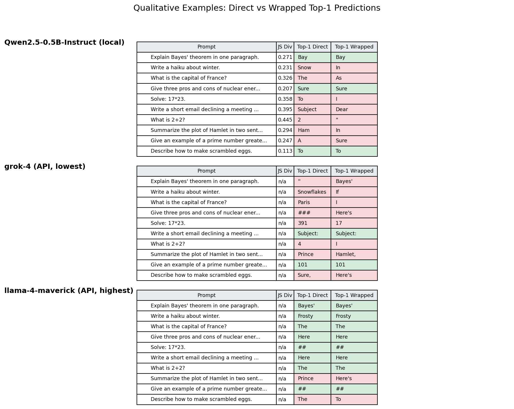

# Self-Prediction Wrapper Experiment

Does a language model predict the same next token when asked directly versus when asked *"What would you say in response to this prompt?"* This experiment measures how a meta-prompt wrapper shifts a model's next-token distribution, comparing a base model (GPT-2) against an instruction-tuned chat model (Qwen2.5-0.5B-Instruct).

## Methodology

### Wrapper

Every prompt is tested in two forms:

- **Direct:** the raw prompt (e.g., `"What is 2+2?"`)
- **Wrapped:** `'What would you say in response to this prompt: "What is 2+2?"'`

For chat models, both forms are formatted through the model's chat template (`apply_chat_template`) with a user role and generation prompt, so the model is in "answering mode" for both.

### Models

| Model | Type | Parameters | Chat Template |
|-------|------|-----------|---------------|
| GPT-2 | Base (pretrained) | 124M | No |
| Qwen2.5-0.5B-Instruct | Instruction-tuned | 494M | Yes |

### Metrics

- **JS Divergence** — Jensen-Shannon divergence between the next-token probability distributions of the direct and wrapped prompts. Symmetric, bounded in [0, ln 2]. Higher = more different.
- **Top-1 Agreement** — Fraction of prompts where the most likely next token is the same for both the direct and wrapped versions.

### Prompts

10 base prompts covering factual, creative, and instruction-following tasks, expanded to N total by appending `(variant K)` suffixes. All runs use seed 0 for reproducibility.

## Results

### Summary

| Model | n_prompts | JS Mean | JS Median | Top-1 Agreement |
|-------|-----------|---------|-----------|-----------------|
| GPT-2 | 200 | 0.164 | 0.167 | 99.5% |
| GPT-2 | 500 | 0.160 | 0.161 | 99.8% |
| Qwen2.5-0.5B-Instruct | 200 | 0.310 | 0.315 | 14.0% |

### Aggregate Metrics



The wrapper has almost no effect on GPT-2's top-1 predictions (>99% agreement) but dramatically shifts Qwen's (only 14% agreement). JS divergence is roughly 2x higher for Qwen.

### Per-Prompt Distribution



The distributions barely overlap: GPT-2's JS divergences cluster around 0.08-0.17, while Qwen's spread across 0.11-0.45.

### Per-Prompt Comparison



On a prompt-by-prompt basis, Qwen consistently shows higher divergence. Both models show higher divergence on math-like prompts ("Solve: 17\*23", "What is 2+2?"), but the gap is most pronounced on tasks where the wrapper changes the pragmatic framing (e.g., email writing, summarization).

### Qualitative Examples



GPT-2 predicts `\n` for nearly every prompt regardless of wrapping — as a base model, it treats the input as a document prefix and expects a line break. The one exception is "Solve: 17\*23." where the direct version predicts `5`.

Qwen produces semantically meaningful first tokens that often change under wrapping: `"Subject"` vs `"Dear"` for the email prompt, `"Snow"` vs `"In"` for the haiku, `"2"` vs `"\""` for "What is 2+2?".

## Interpretation

Base models like GPT-2 are largely indifferent to the wrapper because they don't "understand" prompts as instructions — they just predict the next document token (usually `\n`). Instruction-tuned models like Qwen, trained to follow prompts and answer questions, are sensitive to the wrapper because it changes the pragmatic context from "answer this" to "describe what you would answer to this," leading to different response strategies.

## Reproduction

### Setup

```bash
python -m venv venv
source venv/bin/activate
pip install torch transformers wandb numpy matplotlib pyyaml
```

### Run Experiments

```bash
# Base model
python eval_wrapper.py --model gpt2 --n_prompts 200

# Chat model
python eval_wrapper.py --model Qwen/Qwen2.5-0.5B-Instruct --n_prompts 200
```

### Generate Visualizations

```bash
python visualize.py
```

Figures are saved to `figures/`.

## File Structure

```
self_prediction/
  eval_wrapper.py    # Main experiment script
  visualize.py       # Generates figures from wandb run data
  sample_code.py     # Minimal wandb integration example
  figures/           # Generated PNG charts
  wandb/             # Local wandb run logs
  venv/              # Python virtual environment
```
