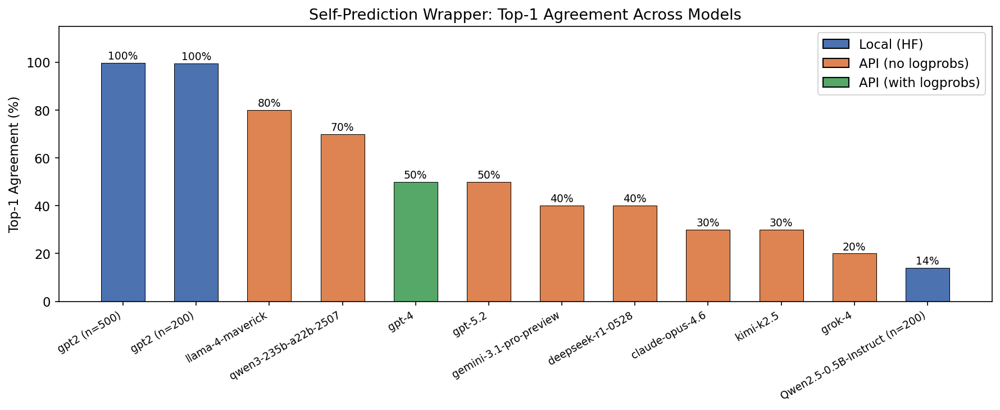
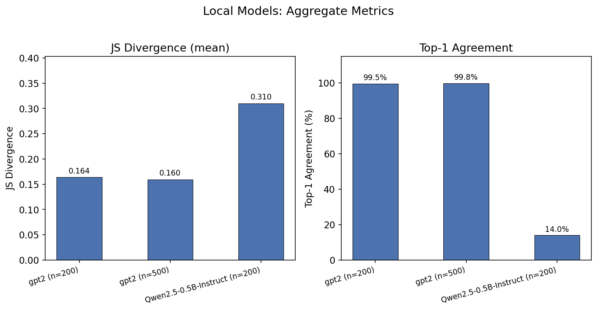
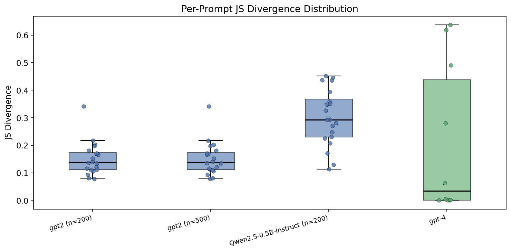

# Self-Prediction Wrapper Experiment

Does a language model predict the same next token when asked directly versus when asked *"What would you say in response to this prompt?"* This experiment measures how a meta-prompt wrapper shifts a model's next-token distribution, comparing base models, small instruction-tuned models, and large frontier API models.

## Methodology

### Wrapper

Every prompt is tested in two forms:

- **Direct:** the raw prompt (e.g., `"What is 2+2?"`)
- **Wrapped:** `'What would you say in response to this prompt: "What is 2+2?"'`

For chat models, both forms are formatted through the model's chat template so the model is in "answering mode" for both.

### Models

| Model | Type | Access | Logprobs |
|-------|------|--------|----------|
| GPT-2 | Base (pretrained) | Local (HF) | Full distribution |
| Qwen2.5-0.5B-Instruct | Instruction-tuned | Local (HF) | Full distribution |
| GPT-4 | Instruction-tuned | OpenRouter API | Top-20 |
| GPT-5.2 | Instruction-tuned | OpenRouter API | No |
| Claude Opus 4.6 | Instruction-tuned | OpenRouter API | No |
| Grok 4 | Instruction-tuned | OpenRouter API | No |
| Gemini 3.1 Pro Preview | Instruction-tuned | OpenRouter API | No |
| Llama 4 Maverick | Instruction-tuned | OpenRouter API | No |
| Qwen3 235B A22B | Instruction-tuned | OpenRouter API | No |
| DeepSeek R1 0528 | Reasoning (CoT) | OpenRouter API | No |
| Kimi K2.5 | Reasoning (CoT) | OpenRouter API | No |

### Metrics

- **JS Divergence** — Jensen-Shannon divergence between the next-token probability distributions of the direct and wrapped prompts. Higher = more different. Only available for models that expose logprobs.
- **Top-1 Agreement** — Fraction of prompts where the most likely next token (first word of the response) is the same for both the direct and wrapped versions. Available for all models.

### Prompts

10 base prompts covering factual, creative, and instruction-following tasks. Local models are tested with up to 500 prompts (expanded via `(variant N)` suffixes). API models use the 10 base prompts to manage costs.

## Results

### Top-1 Agreement Across All Models



| Model | Top-1 Agreement | JS Mean | Notes |
|-------|----------------|---------|-------|
| GPT-2 (base, n=500) | 99.8% | 0.160 | Base model, always predicts `\n` |
| GPT-2 (base, n=200) | 99.5% | 0.164 | Same pattern |
| Llama 4 Maverick | 80% | n/a | Highest among API chat models |
| Qwen3 235B A22B | 70% | n/a | |
| GPT-4 | 50% | 0.210 | |
| GPT-5.2 | 50% | n/a | |
| Gemini 3.1 Pro Preview | 40% | n/a | |
| DeepSeek R1 0528 | 40% | n/a | Reasoning model |
| Claude Opus 4.6 | 30% | n/a | |
| Kimi K2.5 | 30% | n/a | Reasoning model |
| Grok 4 | 20% | n/a | Lowest agreement |
| Qwen2.5-0.5B-Instruct | 14% | 0.310 | Local chat model |

### Key Findings

1. **Base models are indifferent to the wrapper.** GPT-2 predicts `\n` for nearly every prompt regardless of wrapping (>99% agreement). It doesn't "understand" prompts as instructions.

2. **Instruction-tuned models show significant divergence.** All chat/instruct models show <80% top-1 agreement, with most frontier models in the 20-50% range. The wrapper meaningfully changes how these models begin their responses.

3. **Smaller instruction-tuned models diverge more.** Qwen2.5-0.5B-Instruct (14%) shows the lowest agreement, potentially because larger models may be more robust to prompt rephrasing while smaller models are more sensitive to exact wording.

4. **There is a wide range among frontier models.** From Llama 4 Maverick (80%) to Grok 4 (20%), models vary substantially in how much the meta-wrapper changes their first token. This may reflect differences in instruction-following training or how models interpret the self-referential framing.

### Local Models: JS Divergence





### Qualitative Examples


**Grok 4** (lowest agreement, 20%) shows very different first tokens: `"391"` vs `"17"` for the math problem, `"Paris"` vs `"I"` for the capital question. When asked directly, it jumps to the answer; when wrapped, it often shifts to meta-commentary (`"I"`, `"If"`, `"Here's"`).

**Llama 4 Maverick** (highest API agreement, 80%) tends to start the same way regardless — `"Bayes'"`, `"The"`, `"Here"` — suggesting it is less sensitive to the self-referential framing.

## Reproduction

### Setup

```bash
python -m venv venv
source venv/bin/activate
pip install torch transformers wandb numpy matplotlib pyyaml openai
```

### Run Experiments

```bash
# Local models
python eval_wrapper.py --model gpt2 --n_prompts 200
python eval_wrapper.py --model Qwen/Qwen2.5-0.5B-Instruct --n_prompts 200

# API models via OpenRouter
export OPENROUTER_API_KEY="your-key-here"
python eval_wrapper.py --api --model openai/gpt-4 --n_prompts 10
python eval_wrapper.py --api --model anthropic/claude-opus-4.6 --n_prompts 10
python eval_wrapper.py --api --model x-ai/grok-4 --n_prompts 10

# For reasoning/thinking models, increase max_tokens
python eval_wrapper.py --api --model deepseek/deepseek-r1-0528 --n_prompts 10 --max_tokens 4096
python eval_wrapper.py --api --model moonshotai/kimi-k2.5 --n_prompts 10 --max_tokens 4096
```

### Generate Visualizations

```bash
python visualize.py
```

## Limitations

- **API models use first-word comparison** rather than true first-token comparison (no tokenizer access). This is a reasonable approximation but not identical.
- **Most API models lack logprobs**, so JS divergence can only be computed for GPT-4 and local models.
- **Only 10 prompts per API model** — results on larger prompt sets may differ.
- **Thinking/reasoning models** (DeepSeek R1, Kimi K2.5) require large `max_tokens` to get past their chain-of-thought, which may affect cost and behavior. Qwen3.5-27B was excluded entirely as it returned empty responses.
- **`temperature=0`** is used for API calls, but some providers may not guarantee fully deterministic outputs.

## File Structure

```
self_prediction/
  eval_wrapper.py    # Main experiment script (local + API modes)
  visualize.py       # Generates figures from wandb run data
  figures/           # Generated PNG charts
  wandb/             # Local wandb run logs (gitignored)
  venv/              # Python virtual environment (gitignored)
```
